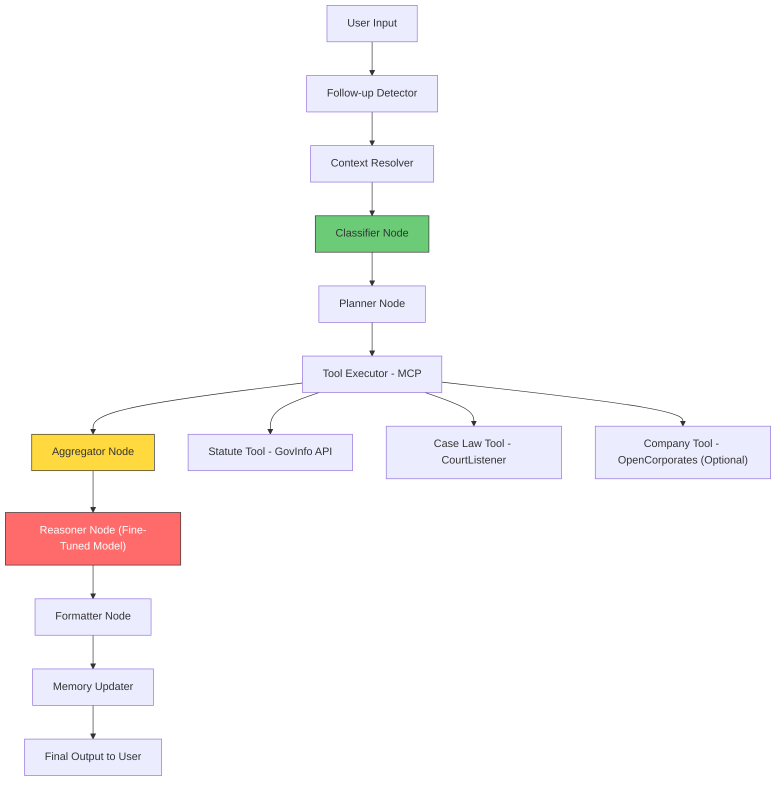
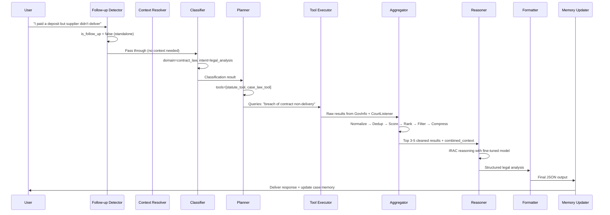

# 📋 Analysis: Legal AI Agent Platform — `legal-system.md`

## Overview

This is a **~3,000-line design document** for a **Contract & Business Legal Intelligence System**. It's structured as a series of progressively deeper design sections — from high-level architecture down to individual node prompts. The document is comprehensive and well-thought-out, covering system goal, architecture, execution flow, prompt engineering, aggregation logic, and conversation management.

---

## 🏗️ Document Structure (6 Major Sections)

The document is actually a concatenation of **6 sequential design iterations**, separated by horizontal rules. Here's how it breaks down:

| Section | Lines | Topic |
|---------|-------|-------|
| **Part 1** | 1–420 | System Goal, Architecture, Components, MCP Tools, LangGraph Workflow, Constraints |
| **Part 2** | 422–930 | Execution Plan — Component-by-component build guide, development phases |
| **Part 3** | 932–1198 | **Reasoning Node System Prompt** (production-ready) |
| **Part 4** | 1200–1505 | **Classifier + Planner Node Prompts** (production-ready) |
| **Part 5** | 1510–1825 | **Aggregator Node Design** — Pipeline, scoring, dedup, filtering |
| **Part 6** | 1828–2720 | **LangGraph Node Mapping** — Shared state schema, node-by-node I/O, conditional flows |
| **Part 7** | 2722–2960 | **Follow-up Detector + Conversation Management** — Multi-turn handling, case memory |

---

## 🧠 System Architecture Summary



### Key Design Principles
- **Fine-Tuned Model** → Legal reasoning ONLY (not data retrieval)
- **Gemini Flash** → Lightweight tasks (classifier, planner, follow-up detection)
- **MCP Tools** → Real legal data (no hallucinated citations)
- **LangGraph** → Orchestration & control flow (NOT the model)

---

## ✅ Strengths of this Design

### 1. Clean Separation of Concerns
Each node has ONE responsibility — classifier classifies, planner plans, reasoner reasons. This is explicitly stated: *"Mixing them = unstable system."*

### 2. Anti-Hallucination Design
The entire system is architecturally designed to prevent hallucination:
- Citations come ONLY from MCP tool outputs
- The fine-tuned model is NOT trained on citations
- Confidence is computed at runtime, not by the model

### 3. Structured Output Contract
A strict JSON output schema is defined and enforced at every level:
```json
{
  "domain": "...",
  "issue": "...",
  "answer": "...",
  "legal_reasoning": "...",
  "legal_basis": [...],
  "citations": [...],
  "confidence": 0.0
}
```

### 4. Production-Ready Prompts
The document includes **4 fully written prompts**, ready to use:
- Reasoning Node prompt (IRAC-style legal analysis)
- Classifier prompt (domain + intent detection)
- Planner prompt (tool selection + query generation)
- Follow-up Detector prompt (conversation continuity)

### 5. Well-Defined Aggregator Pipeline
The 6-step aggregation pipeline (normalize → deduplicate → score → rank → filter → compress) is one of the strongest parts of the design. This is often overlooked in RAG systems.

### 6. Smart Conversation Memory
Using **case_memory** (extracted legal facts) instead of raw chat history is an excellent architectural choice for legal reasoning stability.

---

## ⚠️ Gaps & Risks to Address

### 🔴 Critical Gaps

| Gap | Impact | Recommendation |
|-----|--------|----------------|
| **No error handling spec for API failures** | Tool executor could crash the pipeline | Define fallback behavior per tool — partial results should still flow to reasoner |
| **No rate limiting strategy for APIs** | GovInfo/CourtListener have rate limits | Implement request queuing + exponential backoff |
| **Confidence formula is vague** | `0.5 * keyword_match + 0.3 * domain_match + 0.2 * semantic_similarity` lacks implementation detail | Define concrete scoring functions — keyword overlap % via Jaccard, domain match as binary, semantic similarity via embeddings |
| **No auth/security model** | Production system needs user auth | Add API key management, user session handling, rate limiting per user |
| **Model API setup is hand-waved** | "the model will be setup by external api" — no detail | Specify the inference endpoint contract: URL, auth, request/response schema, timeout, retry policy |

### 🟡 Moderate Gaps

| Gap | Impact | Recommendation |
|-----|--------|----------------|
| **No database/persistence layer defined** | Conversation history, case memory, cache — where do they live? | Specify storage: Redis for cache, PostgreSQL/SQLite for conversation state |
| **No testing strategy** | How do you validate the pipeline works end-to-end? | Add unit tests per node + integration test with sample legal queries |
| **No observability/monitoring** | "logging" is mentioned but not designed | Use structured logging with trace IDs per request. Consider LangSmith for LangGraph tracing |
| **Aggregator relevance scoring needs embeddings** | Keyword match alone is weak for legal text | Consider using a lightweight embedding model for semantic similarity scoring |
| **No deployment architecture** | Where does each component run? | Define: FastAPI server, LangGraph runtime, MCP server topology |

### 🟢 Minor Gaps

| Gap | Recommendation |
|-----|----------------|
| Company Tool (OpenCorporates) is under-specified | Define input/output schema like the other tools |
| PDF export mentioned but not designed | Defer to Phase 3 as planned |
| Multi-jurisdiction flagged as out of scope | Good — keep it deferred |

---

## 🔁 Execution Flow — Full Pipeline Walkthrough

Here's what happens when a user submits: **"I paid a deposit but supplier didn't deliver"**



---

## 🧩 Shared State Schema

This is the **backbone** of the LangGraph — all nodes read/write here:

```json
{
  "conversation_id": "...",
  "user_input": "...",
  "domain": "...",
  "intent": "...",
  "needs_statutes": false,
  "needs_cases": false,
  "tools_to_call": [],
  "queries": [],
  "raw_tool_results": {},
  "aggregated_results": {},
  "final_reasoning": {},
  "final_output": {},
  "conversation_history": [],
  "case_memory": {}
}
```

> [!IMPORTANT]
> The state schema spans two different sections of the doc (lines 1877–1890 for the base schema, lines 2326–2335 for conversation extensions). These should be **merged into a single canonical schema** during implementation.

---

## 🧠 Model Routing Strategy

The doc specifies two models but doesn't fully map which model serves which node:

| Node | Recommended Model | Rationale |
|------|------------------|-----------|
| Follow-up Detector | Gemini Flash | Cheap, fast, simple binary decision |
| Context Resolver | Gemini Flash | Text synthesis, not legal reasoning |
| Classifier | Gemini Flash | Structured classification task |
| Planner | Gemini Flash | Query generation, tool selection |
| **Reasoner** | **Fine-Tuned Model** | Core legal reasoning — the only node that needs domain expertise |
| Formatter | Code logic (no LLM) | JSON validation + assembly — doesn't need an LLM |
| Aggregator | Code logic (no LLM) | Scoring, ranking, filtering — deterministic operations |

> [!TIP]
> The Aggregator and Formatter should be implemented as **pure Python functions**, not LLM calls. This improves speed, determinism, and cost.

---

## 📊 Development Phases (from the doc)

| Phase | Focus | Components |
|-------|-------|------------|
| 🟢 **Phase 1 — Core** | Get reasoning working | Fine-tuned model + Classifier + basic GovInfo API |
| 🟡 **Phase 2 — RAG** | Add retrieval + tools | Planner + MCP tools + Aggregator + Citations |
| 🔵 **Phase 3 — Product** | User-facing features | Frontend + Conversation memory + Confidence scoring |
| 🔴 **Phase 4 — Optimization** | Performance | Caching + Ranking improvements + Latency reduction |

> [!NOTE]
> This phasing is sound. The recommendation to start with **1 API (GovInfo) + simple flow** before expanding is practical.

---

## 🔥 Key Architectural Decisions Summary

1. **LangGraph controls tools, NOT the model** — The fine-tuned model never directly calls tools
2. **Citations are never trained into the model** — They come exclusively from MCP tool outputs
3. **Confidence is runtime-computed** — Based on source count, agreement, and reasoning clarity
4. **Conversation memory stores facts, not transcripts** — `case_memory` > raw `conversation_history`
5. **Max 5 references total** — Hard cap on context sent to reasoner to prevent noise
6. **Conditional flow** — Skip tool execution entirely when `needs_statutes` and `needs_cases` are both false

---

## 🎯 Recommended Next Steps

1. **Merge the state schemas** — Unify the base state (line 1877) and conversation state (line 2326) into one canonical `TypedDict` or Pydantic model
2. **Define the fine-tuned model API contract** — URL, auth, request/response format, timeout, retry
3. **Implement Phase 1** — Classifier + Reasoner + GovInfo Statute Tool as a minimal working pipeline
4. **Set up LangGraph skeleton** — Define the graph with all nodes, even if some are stubs
5. **Build the Aggregator as pure Python** — No LLM needed here, just scoring and filtering logic
6. **Add structured logging** — Trace IDs per request, latency per node, tool call results

---

> [!IMPORTANT]
> **Bottom line:** This is a well-structured, production-aligned design. The separation of concerns is clean, the anti-hallucination architecture is sound, and the prompts are ready to use. The main work ahead is **implementation** — translating these specs into working LangGraph code, wiring up the APIs, and deploying the fine-tuned model endpoint.
