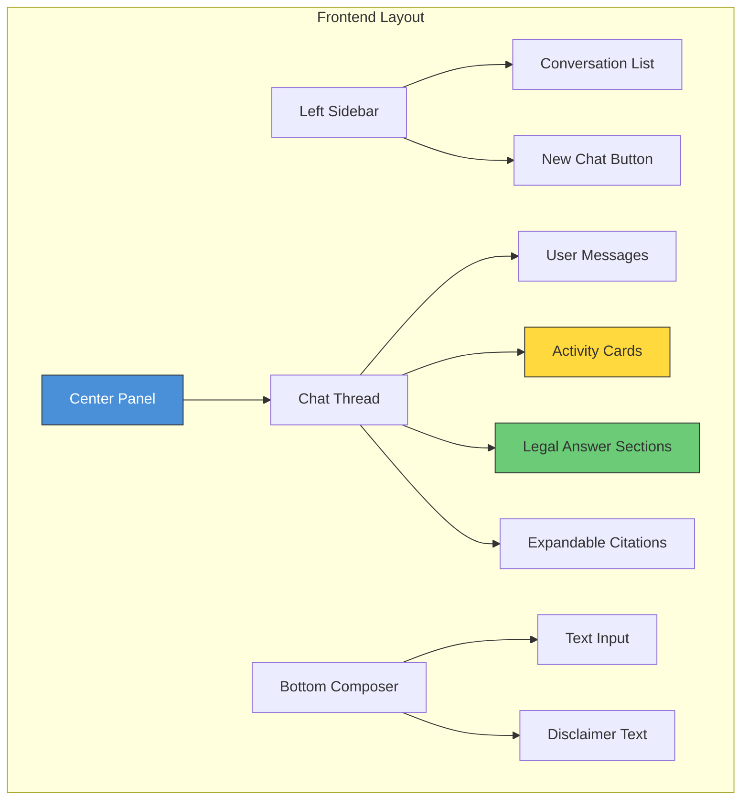
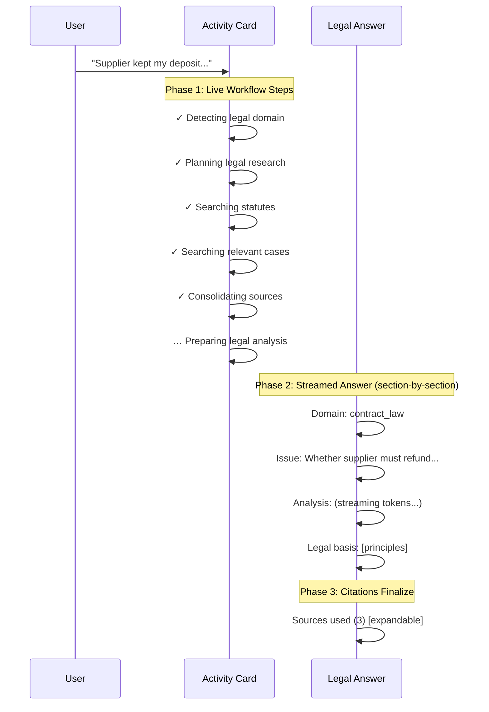

# 📋 Analysis: Legal Agent App UI — `app-ui.md`

## Overview

This is a **2,107-line frontend/UX design document** for the Legal AI Agent platform. Like the backend doc, it's structured as **6 sequential design iterations** — starting from basic chat layout and progressively deepening into streaming architecture, event protocol, and runtime state schema.

---

## 📂 Document Structure (6 Sections)

| Section | Lines | Topic |
|---------|-------|-------|
| **Part 1** | 1–273 | Core UI layout, message flow, sources UI, UX rules, MVP scope |
| **Part 2** | 274–512 | Workflow visibility — progressive step indicators, tool labels |
| **Part 3** | 514–887 | Streaming UX — 3-phase interaction model, section streaming, follow-up handling |
| **Part 4** | 889–1326 | Frontend event architecture — SSE transport, event types, frontend state model |
| **Part 5** | 1328–1717 | Backend event contract — 13 event types with full JSON payloads |
| **Part 6** | 1719–2107 | LangGraph runtime state schema — canonical state object, mutation rules |

---

## 🏗️ UI Architecture at a Glance



### Key Design Decision: ChatGPT-style Interface
The doc explicitly models the UI after a **ChatGPT-like chat interface** — sidebar for conversations, central chat thread, bottom text input. This is a deliberate choice for familiarity.

---

## 🎯 Three-Phase Interaction Model

This is the core UX pattern. Every user query triggers three visual phases:



> [!IMPORTANT]
> The activity card stays visible above the answer (muted). This gives **process traceability** — users can always see what work the system did.

---

## 📡 Event Protocol — 13 SSE Event Types

The document defines a complete **Server-Sent Events (SSE)** protocol with exactly 13 event types. This is the contract between backend and frontend.

### Event Envelope (every event)
```json
{
  "run_id": "uuid",
  "conversation_id": "uuid",
  "timestamp": "ISO-8601",
  "event": "event_name",
  "seq": 14,
  "payload": {}
}
```

### Complete Event Catalog

| # | Event | Emitted By | Frontend Behavior |
|---|-------|-----------|-------------------|
| 1 | `run_started` | Runtime | Create activity card + assistant placeholder |
| 2 | `step_started` | Any node | Show current active step with spinner |
| 3 | `step_completed` | Any node | Mark step with ✓ checkmark |
| 4 | `step_output` | Classifier/Planner | Optional — store internal output for debugging |
| 5 | `tool_started` | Tool Executor | Show "Searching statutes..." line |
| 6 | `tool_result` | Tool Executor | Update source preview pills |
| 7 | `tool_failed` | Tool Executor | Show non-blocking warning |
| 8 | `sources_aggregated` | Aggregator | Show "4 sources consolidated" |
| 9 | `answer_started` | Reasoner | Create final answer container |
| 10 | `answer_delta` | Reasoner | Append streamed tokens |
| 11 | `answer_completed` | Reasoner | Deliver full structured JSON response |
| 12 | `followup_requested` | Classifier | Pause run, render clarification question |
| 13 | `run_completed` | Runtime | Freeze activity card, finalize UI |

### Node → Event Mapping

| LangGraph Node | Events Emitted |
|---------------|----------------|
| Classifier | `step_started` → `step_output` → `step_completed` |
| Planner | `step_started` → `step_output` → `step_completed` |
| Tool Executor | `tool_started` → `tool_result` / `tool_failed` |
| Aggregator | `step_started` → `sources_aggregated` → `step_completed` |
| Reasoner | `answer_started` → `answer_delta` → `answer_completed` |
| Finalizer | `run_completed` |

---

## 🗄️ LangGraph Runtime State Schema (Canonical)

The document defines a **single canonical state object** that all nodes read/write. This is more refined than the one in `legal-system.md`.

```json
{
  "run_id": "uuid",
  "conversation_id": "uuid",
  "user_input": "",
  "followup_context": null,
  "classification": {
    "domain": "contract_law",
    "intent": "legal_analysis",
    "confidence": 0.91
  },
  "plan": {
    "tool_calls": [...],
    "parallel": true
  },
  "retrieval": {
    "govinfo_statute_search": [...],
    "courtlistener_case_search": [...]
  },
  "aggregation": {
    "legal_sources": [...],
    "retrieval_summary": "..."
  },
  "reasoning": {
    "case_facts": "...",
    "legal_issue": "...",
    "reasoning_context": [...]
  },
  "output": {
    "domain": "...",
    "issue": "...",
    "answer": "...",
    "legal_reasoning": "...",
    "legal_basis": [...],
    "citations": [...],
    "confidence": 0.84
  },
  "meta": {
    "created_at": "...",
    "started_at": "...",
    "completed_at": "...",
    "status": "running"
  }
}
```

### State Mutation Rules (Critical)

Each node can ONLY write to its designated state slot:

| Node | May Write To |
|------|-------------|
| Classifier | `classification` |
| Planner | `plan` |
| Tool Executor | `retrieval` |
| Aggregator | `aggregation` |
| Reasoner | `reasoning` + `output` |
| Runtime Manager | `meta` |

> [!WARNING]
> **"Earlier nodes should never overwrite later nodes."** This is an explicit architectural rule to keep graph execution predictable and debuggable.

---

## ✅ Strengths

### 1. Production-Grade Event Protocol
The 13-event SSE protocol is clean, minimal, and well-specified. Each event has a concrete JSON payload example. This is ready to implement.

### 2. Progressive Disclosure UX
The three-phase model (activity → streamed answer → citations) gives users information early without overwhelming them. Source citations are expandable-by-default.

### 3. Human-Readable Tool Labels
The doc explicitly maps internal tool names to friendly labels:

| Internal | User-Facing |
|----------|-------------|
| `govinfo_statute_search` | Searching statutes |
| `courtlistener_case_search` | Searching relevant cases |
| `aggregator` | Consolidating legal sources |

### 4. Follow-up UX is Well-Designed
When facts are missing, the pipeline **pauses gracefully** — the activity card freezes, a clarification question appears, and on user reply, the pipeline resumes with "✓ Updating case facts" as the first step.

### 5. State Schema Maps to Training Data
The document explicitly maps the runtime state to the fine-tuning dataset:
- `case` → `user_input`
- `domain` → `classification.domain`
- `issue` → `reasoning.legal_issue`
- `reasoning` → `output.legal_reasoning`
- `judgment` → `output.answer`

### 6. Append-Only Event Design
Events are **never mutated**, only appended. This enables reliable replay, easy debugging, and stable frontend rendering.

---

## ⚠️ Gaps & Risks

### 🔴 Critical

| Gap | Impact | Recommendation |
|-----|--------|----------------|
| **No responsive/mobile design** | Legal professionals use tablets and phones | Define breakpoints and mobile layout (sidebar → drawer) |
| **No authentication/authorization** | Who can access the system? | Add login, session management, role-based access |
| **No error boundary design** | What does the user see on catastrophic failure? | Define error states: network loss, backend crash, timeout |
| **SSE reconnection strategy missing** | Network drops will lose events | Implement reconnection with `seq` number-based replay |
| **`followup_context` vs `case_memory`** | The `app-ui.md` uses `followup_context` while `legal-system.md` uses `case_memory` — these are different patterns | Unify into one canonical approach |

### 🟡 Moderate

| Gap | Impact | Recommendation |
|-----|--------|----------------|
| **No dark mode / theming** | Modern expectation | Add CSS custom properties for theme switching |
| **No accessibility (a11y) spec** | Legal products need accessibility compliance | Add ARIA labels, keyboard navigation, screen reader support |
| **No loading skeleton design** | Initial page load may feel empty | Add skeleton screens for conversation list and chat area |
| **No copy/export functionality detailed** | "copy/export pdf" mentioned but not designed | Define PDF generation — client-side (jsPDF) vs server-side |
| **No rate limiting feedback** | Users could spam the input | Add input debouncing + "please wait" state |
| **Section streaming parsing** | How does frontend know which section is streaming? | Need section delimiter tokens or structured section events |

### 🟢 Minor

| Gap | Recommendation |
|-----|----------------|
| Conversation title auto-generation not specified technically | Use the classifier domain + first user message summary |
| No empty state design (new user, no conversations) | Add onboarding prompt/examples |
| No conversation deletion/archival | Defer to later phase |

---

## 🔄 Cross-Reference: `app-ui.md` vs `legal-system.md`

The two documents are complementary but have some **inconsistencies** to resolve:

| Topic | `legal-system.md` | `app-ui.md` | Resolution |
|-------|-------------------|-------------|------------|
| State schema | Flat keys (`user_input`, `domain`, `raw_tool_results`) | Nested objects (`classification.domain`, `retrieval.govinfo_*`) | **Use `app-ui.md` version** — it's more refined and production-ready |
| Conversation memory | `case_memory` + `conversation_history` | `followup_context` with `previous_run_id` | **Merge both** — `followup_context` for immediate follow-ups, `case_memory` for persistent facts |
| Confidence | Runtime-computed only | Also appears in `classification.confidence` | Clarify: **classification confidence ≠ output confidence**. Both are valid. |
| Follow-up detection | Dedicated Follow-up Detector node + Context Resolver | `followup_requested` event from classifier | **Backend should use the full 2-node approach** from `legal-system.md`; frontend renders just the event |
| Tech stack | FastAPI backend, LangGraph | Next.js + React frontend, SSE transport | ✅ Compatible — no conflict |

> [!IMPORTANT]
> The `app-ui.md` state schema (Section 6, lines 1719–2107) should be treated as the **canonical production schema**, as it's more structured and detailed than the one in `legal-system.md`.

---

## 🧩 Frontend State Model

The doc recommends this client-side structure:

```
chat
 ├─ messages[]           // All user + assistant messages
 ├─ active_run
 │    ├─ steps[]         // Workflow step states (pending/active/complete)
 │    ├─ tool_results[]  // Retrieved sources preview
 │    ├─ streamed_answer // Token accumulator
 │    └─ status          // running | completed | paused | error
 └─ conversations[]     // Sidebar list
```

> [!TIP]
> One assistant turn = **two linked UI objects**: an Activity Card (workflow trace) + a Final Answer (legal analysis). This dual-object pattern is the key to keeping the UI clean while showing full process transparency.

---

## 🎨 Recommended Answer Structure (Rendered)

Each legal answer streams in **5 progressive sections**:

```
┌─────────────────────────────────────────┐
│ Detected Domain                         │
│ contract_law                            │
├─────────────────────────────────────────┤
│ Legal Issue                             │
│ Whether the supplier's failure to       │
│ deliver constitutes breach requiring    │
│ restitution.                            │
├─────────────────────────────────────────┤
│ Analysis                                │
│ (Main legal reasoning — streamed        │
│  token-by-token via answer_delta)       │
├─────────────────────────────────────────┤
│ Legal Basis                             │
│ • Contract performance obligations      │
│ • Restitution after non-performance     │
│ • Damages principles                    │
├─────────────────────────────────────────┤
│ ▸ Sources used (3)  [expandable]        │
│   • UCC § 2-711 — GovInfo 🔗           │
│   • Smith v. Jones (2023) — CL 🔗      │
│   • 29 U.S.C. § 201 — GovInfo 🔗      │
└─────────────────────────────────────────┘
```

---

## 🎯 Key Architectural Rules (from the doc)

1. **"Frontend is presentation only"** — Never infer legal logic client-side
2. **"LangGraph is an event producer, Frontend is an event renderer"** — Clean separation
3. **"Every event must be append-only"** — No mutations, only appends
4. **"Earlier nodes should never overwrite later nodes"** — Predictable state flow
5. **"Do not expose hidden chain-of-thought"** — Show process steps, NOT internal reasoning
6. **"Keep the protocol small and stable"** — Exactly 13 events, no more for now

---

## 🚀 Recommended Next Steps

1. **Unify state schemas** across both documents into one canonical TypedDict/Pydantic model
2. **Define SSE reconnection strategy** — Use `seq` numbers + `Last-Event-ID` header
3. **Design section streaming** — Add section delimiter tokens (e.g., `### domain:`, `### issue:`) so frontend can render sections progressively
4. **Build the event emitter** — A thin utility in LangGraph that wraps node execution with automatic `step_started`/`step_completed` events
5. **Create the React component hierarchy**:
   - `<ChatThread>` → `<MessageList>` → `<UserMessage>` | `<AssistantTurn>`
   - `<AssistantTurn>` → `<ActivityCard>` + `<LegalAnswer>`
   - `<LegalAnswer>` → `<DomainBadge>` + `<IssueSection>` + `<AnalysisSection>` + `<LegalBasis>` + `<SourcesPanel>`

---

> [!IMPORTANT]
> **Bottom line:** This is a comprehensive, well-thought-out frontend architecture. The SSE event protocol is production-grade, the UX pattern is clean, and the state schema is the most refined version across both documents. The main work is implementing the React components, wiring up the SSE listener, and ensuring the backend emits events in the correct format.
